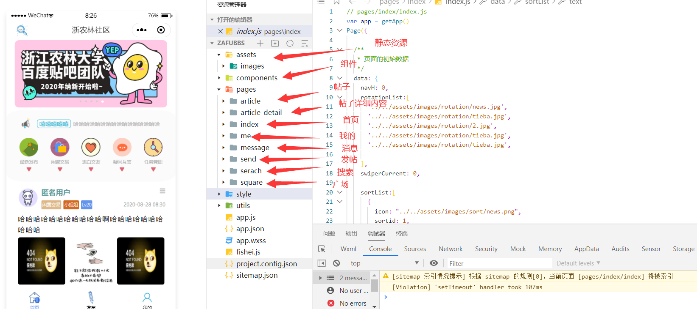
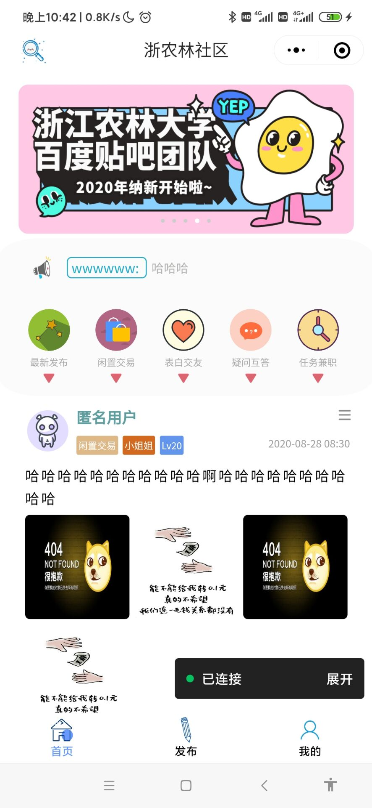
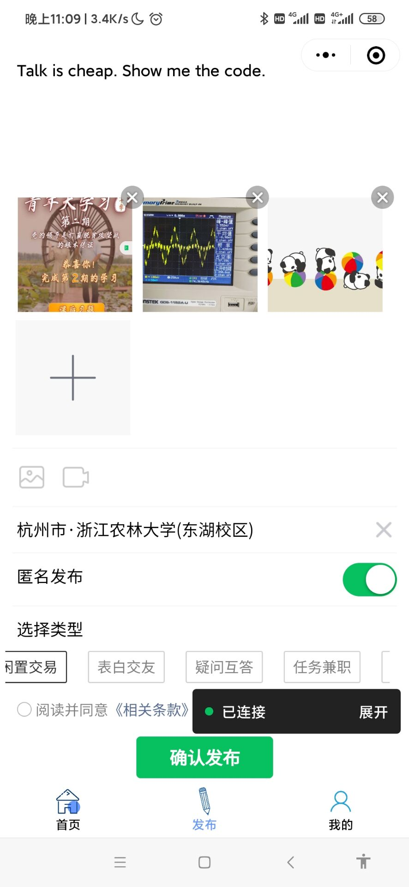
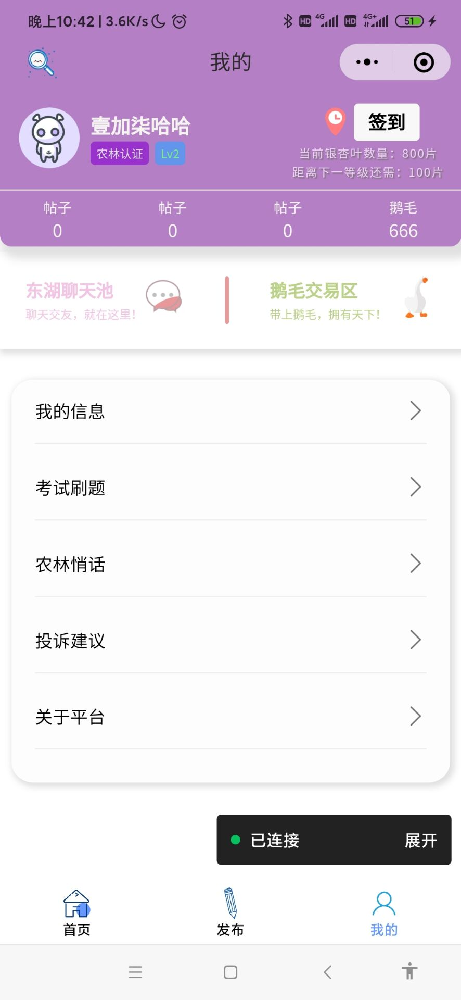
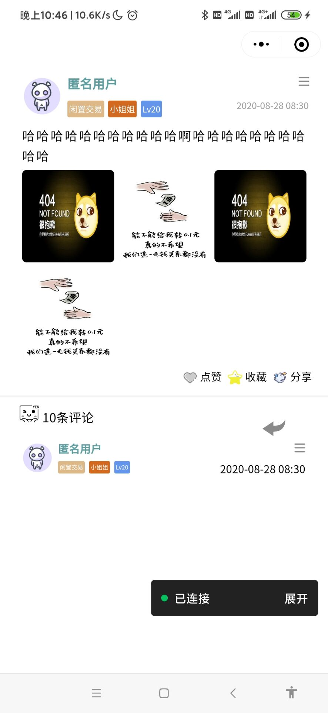

## 浙农林校园微社区综合服务平台

### 一、项目背景

​	
此处省略5000字~
​	开源分享，学习进步！

**在此特别感谢两个人：沈老师、Cherl！**

### 二、项目进度

本打算包括前后端能在10月底完成，能够初步运行整个项目，开发周期大概三个多月，眼看时间快到了，自己也很久没更新代码了。整个项目只实现了大部分前端页面美化以及前端逻辑功能，并未涉及后端交互。

### 三、项目简介

这是一款基于微信小程序开发的校园综合服务平台。

- 板块分类:闲置交易、表白交友、疑问互答、失物招领等等

- 可发布帖子，发布帖子时有包括发布地点、是否匿名、分区板块、可添加文字内容、可添加图片或视频内容
- 首页轮播图广告

- 首页轮播公共聊天区最新聊天内容

- 展示帖子详细信息，可进行评论、分享、点赞、删除等功能

- 展示个人信息区(用户信息、等级、积分、帖子等等)

- 扩展更多功能(商城、修改个人信息、在线刷题、)
- ......

### 四、页面展示

> **目录说明**

> **各页面展示**

- 

> 2020年10月21日——壹加柒
